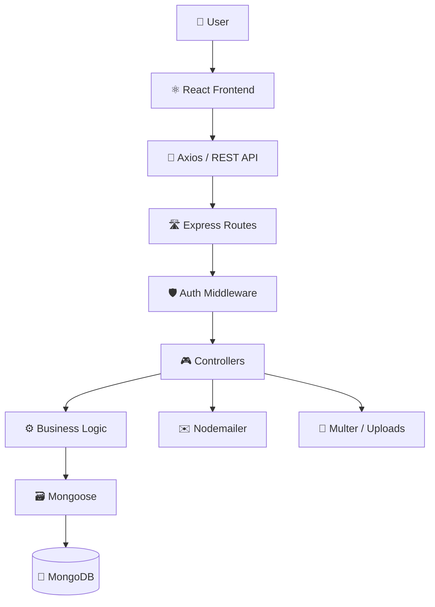

<div align="center">

# 📋 Trello Clone

### 🚀 Organize Your Work • Manage Your Tasks • Collaborate Better

A modern full-stack project management application inspired by Trello, built with **React, Node.js, Express, MongoDB, and Mongoose**.

<br />

[](https://react.dev/)
[](https://vite.dev/)
[](https://tailwindcss.com/)
[](https://nodejs.org/)
[](https://expressjs.com/)
[](https://www.mongodb.com/)

<br />


<br />
<br />

[](https://github.com/aryanp-tech/trello)
[](https://github.com/aryanp-tech/trello/stargazers)
[](https://github.com/aryanp-tech/trello/commits/main)

</div>

---

## 🧭 Table of Contents

- [✨ Overview](#-overview)
- [🌟 Highlights](#-highlights)
- [🔥 Features](#-features)
- [🛠️ Tech Stack](#️-tech-stack)
- [🏗️ Architecture](#️-architecture)
- [🔄 Request Flow](#-request-flow)
- [📁 Project Structure](#-project-structure)
- [🔐 Authentication](#-authentication)
- [📋 Board & Kanban Workflow](#-board--kanban-workflow)
- [📝 Card Workflow](#-card-workflow)
- [🖱️ Drag & Drop](#️-drag--drop)
- [📎 Card Attachments](#-card-attachments)
- [👥 Member Invitations](#-member-invitations)
- [🔑 Password Reset](#-password-reset)
- [⚡ Performance](#-performance)
- [🌐 REST API](#-rest-api)
- [🔧 Environment Variables](#-environment-variables)
- [🚀 Getting Started](#-getting-started)
- [🧪 API Testing](#-api-testing)
- [🔒 Security](#-security)
- [📱 Responsive UI](#-responsive-ui)
- [📸 Screenshots](#-screenshots)
- [🔮 Future Improvements](#-future-improvements)
- [🤝 Contributing](#-contributing)
- [👨‍💻 Author](#-author)
- [📄 License](#-license)

---

## ✨ Overview

**Trello Clone** is a full-stack project and task management application built around a **Kanban-style workflow**.

It lets authenticated users create and manage boards, organize work into customizable columns, create task cards, move cards between workflow stages, upload attachments, and collaborate with other board members.

The project is focused on **real-world full-stack development**, not just reproducing a UI. It demonstrates practical concepts such as:

- 🔐 JWT authentication with access + refresh tokens
- 🛡️ Protected APIs and resource-level access checks
- 📋 Board and column management
- 📝 Kanban card management
- 🖱️ Drag-and-drop interactions
- ⚡ Optimistic UI updates
- 📎 Local file uploads
- 👥 Email-based board invitations
- 🔑 Secure password reset links
- 🌐 REST API architecture
- 🗃️ MongoDB + Mongoose data modeling
- 📱 Responsive frontend design

---

## 🌟 Highlights

<table>
<tr>
<td width="33%" align="center">

### 🔐 Secure Auth

JWT access/refresh token flow with protected routes.

</td>

<td width="33%" align="center">

### 🗂️ Kanban Boards

Organize work with customizable lists and cards.

</td>

<td width="33%" align="center">

### ⚡ Smooth UX

Optimistic updates + interactive drag & drop.

</td>
</tr>

<tr>
<td width="33%" align="center">

### 👥 Collaboration

Invite users to boards through email.

</td>

<td width="33%" align="center">

### 📎 Attachments

Upload and manage files directly on cards.

</td>

<td width="33%" align="center">

### 🎨 Custom Boards

Use colors, images, descriptions and starred boards.

</td>
</tr>
</table>

---

## 🔥 Features

### 🔐 Authentication & Account

- ✅ User registration
- ✅ User login
- ✅ JWT access token authentication
- ✅ Refresh token flow
- ✅ Protected frontend routes
- ✅ Protected backend endpoints
- ✅ Persistent authenticated session
- ✅ Logout
- ✅ Password hashing with `bcryptjs`
- ✅ Forgot password
- ✅ Secure password reset token
- ✅ Password reset token expiration

### 📊 Dashboard

- ✅ View boards available to the authenticated user
- ✅ Create, edit and delete boards
- ✅ Star / unstar boards
- ✅ Open a board workspace
- ✅ Access the user profile

### 📋 Board Management

- ✅ Create boards
- ✅ Edit title and description
- ✅ Set background color
- ✅ Set background image URL
- ✅ Star / unstar boards
- ✅ Add custom columns/lists
- ✅ Rename columns
- ✅ Delete columns
- ✅ Remove cards belonging to deleted columns
- ✅ Board member management

### 📝 Cards / Tasks

- ✅ Create cards
- ✅ Edit cards
- ✅ Delete cards
- ✅ Card title and description
- ✅ Assign card to a list
- ✅ Move cards between lists
- ✅ Maintain card positions
- ✅ View card details
- ✅ Upload card attachments
- ✅ Replace / remove old attachments

### 🖱️ Board Interaction

- ✅ Drag cards within a list
- ✅ Move cards between lists
- ✅ Optimistic UI updates
- ✅ Roll back UI state when a move fails
- ✅ Horizontal board scrolling
- ✅ Pointer-based board panning
- ✅ Add lists directly from the board workspace

### 👥 Collaboration

- ✅ Invite members by email
- ✅ Secure invitation tokens
- ✅ Invitation expiration
- ✅ Invitation email validation
- ✅ Accept invitation from a dedicated page
- ✅ Prevent duplicate membership

---

## 🛠️ Tech Stack

<div align="center">

| Layer | Technologies |
|---|---|
| 🎨 **Frontend** | React 19, Vite, Tailwind CSS, React Router DOM, Axios |
| ⚙️ **Backend** | Node.js, Express 5 |
| 🗃️ **Database** | MongoDB, Mongoose |
| 🔐 **Authentication** | JWT, bcryptjs |
| ✉️ **Email** | Nodemailer + SMTP |
| 📎 **File Uploads** | Multer |
| 🔄 **State / Logic** | React Context API, Custom Hooks |
| 🧪 **API Testing** | Postman |
| 🧰 **Tools** | Git, GitHub, VS Code |

</div>

---

## 🏗️ Architecture

### 🌐 High-Level Architecture



---

## 🔄 Request Flow

```text
👤 User
   │
   ▼
⚛️ React Component
   │
   ▼
🪝 Custom Hook / Context
   │
   ▼
🌐 Service Layer
   │
   ▼
📡 Axios
   │
   ▼
🛣️ Express Route
   │
   ▼
🛡️ Middleware
   │
   ▼
🎮 Controller
   │
   ▼
🗃️ Mongoose
   │
   ▼
🍃 MongoDB
```

---

## 📁 Project Structure

```text
trello/
│
├── 📂 backend/
│   ├── 📂 controllers/
│   │   ├── board.controller.js
│   │   ├── card.controller.js
│   │   └── user.controllers.js
│   │
│   ├── 📂 middleware/
│   │   ├── auth.middleware.js
│   │   └── upload.middleware.js
│   │
│   ├── 📂 models/
│   │   ├── board.model.js
│   │   ├── card.models.js
│   │   ├── board-invite.model.js
│   │   ├── password-reset.model.js
│   │   └── user.model.js
│   │
│   ├── 📂 routes/
│   │   ├── auth.user.js
│   │   ├── board.routes.js
│   │   └── card.routes.js
│   │
│   ├── 📂 services/
│   │   └── mail.service.js
│   │
│   ├── 📂 db/
│   │   └── db.js
│   │
│   ├── 📂 uploads/
│   ├── 📂 src/
│   │   └── app.js
│   ├── server.js
│   └── package.json
│
├── 📂 frontend/
│   ├── 📂 src/
│   │   ├── 📂 components/
│   │   ├── 📂 context/
│   │   ├── 📂 hooks/
│   │   ├── 📂 pages/
│   │   ├── 📂 services/
│   │   ├── App.jsx
│   │   └── main.jsx
│   │
│   ├── 📂 public/
│   └── package.json
│
└── 📄 README.md
```

---

## 🔐 Authentication

The application uses a short-lived **access token** together with a **refresh token**.

### 🔑 Login Flow

```text
👤 Enter email + password
          ↓
🧠 Backend validates credentials
          ↓
🔐 Access token + refresh token generated
          ↓
💾 Frontend stores session tokens
          ↓
📡 Protected requests use Bearer access token
```

### ⏱️ Token Lifetime

- 🔸 Access token: **15 minutes**
- 🔸 Refresh token: **7 days**

### 🔄 Automatic Refresh

```text
📡 API Request
     ↓
⚠️ 401 Unauthorized
     ↓
🔄 Refresh access token
     ↓
🎟️ New access token
     ↓
🔁 Retry original request
```

The frontend Axios client handles this flow so individual UI components do not need to manually implement token-refresh logic.

---

## 📋 Board & Kanban Workflow

A board acts as the main workspace for tasks.

```text
┌──────────────────────────────────────────────┐
│                  📋 BOARD                    │
├──────────────┬──────────────┬───────────────┤
│   📝 TODO    │   🔨 DOING   │    ✅ DONE    │
├──────────────┼──────────────┼───────────────┤
│  Card 1      │  Card 3      │  Card 5       │
│  Card 2      │  Card 4      │  Card 6       │
└──────────────┴──────────────┴───────────────┘
```

A board stores information such as:

```text
📋 Board
├── 🏷️ title
├── 📝 description
├── 🎨 backgroundColor
├── 🖼️ backgroundImage
├── ⭐ isStarred
├── 📚 columns[]
├── 👥 members[]
└── 👤 createdBy
```

Columns can be dynamically added, renamed and deleted.

When a column is deleted, cards belonging to that column are removed as part of the board-management flow.

---

## 📝 Card Workflow

Each card represents an individual task.

```text
📝 Card
├── 🆔 board
├── 👤 createdBy
├── 🏷️ title
├── 📄 description
├── 📚 list
├── 🔢 position
└── 📎 attachment
```

A card's `list` represents its workflow stage, while `position` determines its order inside that list.

---

## 🖱️ Drag & Drop

The board provides an interactive Kanban experience.

```text
┌─────────────┐      🖱️ Drag      ┌─────────────┐
│   📝 TODO   │ ─────────────────▶ │  🔨 DOING   │
└─────────────┘                    └─────────────┘
                                         │
                                     🖱️ Drag
                                         ▼
                                  ┌─────────────┐
                                  │  ✅ DONE    │
                                  └─────────────┘
```

The UI updates immediately when a card is moved. If persistence fails, the previous local state can be restored.

### ↔️ Board Panning

Large boards may extend beyond the viewport, so the workspace also supports pointer-based horizontal panning.

```text
Pointer Down
     ↓
Record Position
     ↓
Pointer Move
     ↓
Scroll Board
     ↓
Pointer Up
```

---

## 📎 Card Attachments

Cards support local file uploads through `multipart/form-data` and **Multer**.

### 📦 Upload Limits

- Maximum size: **10 MB**
- Supported types:
  - 📄 PDF
  - 🖼️ JPEG / PNG / GIF / WebP
  - 📝 TXT
  - 📄 DOC / DOCX

Files are stored under the backend `uploads/` directory and served through the `/uploads` static route.

When an attachment is replaced or removed, the previous local file is deleted from storage.

---

## 👥 Member Invitations

Board owners can invite users through email.

### ✉️ Invitation Flow

```text
👑 Board Owner
      ↓
📧 Enter member email
      ↓
🔐 Generate secure token
      ↓
#️⃣ Store token hash in MongoDB
      ↓
✉️ Send invitation email
      ↓
🔗 Recipient opens invite
      ↓
🔑 Sign in / Register with invited email
      ↓
✅ Accept invitation
      ↓
👥 User added to board
```

### 🛡️ Invitation Security

- Secure token generation using Node.js `crypto`
- SHA-256 hash stored in MongoDB
- Invitations expire after **7 days**
- Invitation email must match the authenticated user's email
- Accepted/revoked invitations cannot be reused
- Duplicate board membership is prevented

---

## 🔑 Password Reset

Password recovery uses a **secure reset link**, not a numeric OTP.

### 🔄 Reset Flow

```text
🔓 Forgot Password
        ↓
📧 Enter email
        ↓
🔐 Generate secure random token
        ↓
#️⃣ Store token hash
        ↓
✉️ Send reset email
        ↓
🔗 Open reset link
        ↓
🔑 Create new password
        ↓
✅ Token marked as used
        ↓
🚪 Existing refresh token cleared
```

### ⏳ Reset Token Rules

- Token generated with `crypto.randomBytes`
- Only the hash is stored in the database
- Reset link expires after **30 minutes**
- Used tokens cannot be reused
- Previous outstanding reset requests are cleared before creating a new one

---

## ⚡ Performance

A key design goal is to avoid sending and rewriting unnecessary board data when a single card changes.

### ❌ Heavy Approach

```json
{
  "cards": [
    "card-1",
    "card-2",
    "card-3",
    "...",
    "card-1000"
  ]
}
```

### ✅ Targeted Update

Only the changed card information needs to be persisted for a simple move/update:

```json
{
  "list": "doing"
}
```

This reduces unnecessary payload size and database work.

### 🚀 Other Scalability Ideas

For larger deployments, the architecture can be extended with:

- 📑 Pagination / cursors
- 🗂️ MongoDB indexes
- ⏱️ Debounced position persistence
- 🔌 WebSockets for real-time collaboration
- ⚡ Redis caching where appropriate
- ☁️ Cloud object storage for attachments
- 📨 Background email processing
- 🛡️ API rate limiting

---

## 🌐 REST API

Base URL used by the current frontend:

```text
http://localhost:5000/api
```

### 🔐 Authentication

| Method | Endpoint | Description |
|---|---|---|
| `POST` | `/api/auth/register` | Create a user |
| `POST` | `/api/auth/login` | Authenticate user |
| `POST` | `/api/auth/refresh` | Refresh access token |
| `POST` | `/api/auth/forgot-password` | Send reset email |
| `POST` | `/api/auth/reset-password/:token` | Set a new password |

### 📋 Boards

| Method | Endpoint | Description |
|---|---|---|
| `POST` | `/api/boards` | Create board |
| `GET` | `/api/boards` | Get accessible boards |
| `PUT` | `/api/boards/:id` | Update board |
| `DELETE` | `/api/boards/:id` | Delete board |
| `DELETE` | `/api/boards/:id/columns/:columnId` | Delete column and its cards |
| `POST` | `/api/boards/:id/invites` | Send board invitation |
| `GET` | `/api/boards/invites/:token` | Accept board invitation |

### 📝 Cards

| Method | Endpoint | Description |
|---|---|---|
| `POST` | `/api/boards/:boardId/cards` | Create card |
| `GET` | `/api/boards/:boardId/cards` | Get board cards |
| `PUT` | `/api/boards/:boardId/cards/:cardId` | Update card |
| `DELETE` | `/api/boards/:boardId/cards/:cardId` | Delete card |

### 🎟️ Authorization Header

Protected requests use:

```http
Authorization: Bearer <access_token>
```

---

## 🔧 Environment Variables

Create a `.env` file inside `backend/`:

```env
PORT=5000

MONGO_URI=your_mongodb_connection_string

JWT_SECRET=your_access_token_secret
JWT_REFRESH_SECRET=your_refresh_token_secret

FRONTEND_URL=http://localhost:5173

SMTP_HOST=smtp-relay.brevo.com
SMTP_PORT=587
SMTP_USER=your_smtp_username
SMTP_PASS=your_smtp_password
SMTP_FROM=your_sender_email
```

### 🧾 Variable Reference

| Variable | Purpose |
|---|---|
| `PORT` | Backend server port |
| `MONGO_URI` | MongoDB connection string |
| `JWT_SECRET` | Access token signing secret |
| `JWT_REFRESH_SECRET` | Refresh token signing secret |
| `FRONTEND_URL` | Frontend base URL used for generated links |
| `SMTP_HOST` | SMTP server hostname |
| `SMTP_PORT` | SMTP server port |
| `SMTP_USER` | SMTP username |
| `SMTP_PASS` | SMTP password |
| `SMTP_FROM` | Optional sender address |

> ⚠️ **Never commit `.env` files or real credentials to GitHub.**

---

## 🚀 Getting Started

### ✅ Prerequisites

Make sure you have:

- 🟢 Node.js installed
- 📦 npm installed
- 🍃 MongoDB or MongoDB Atlas
- 🔧 Git

### 1️⃣ Clone the repository

```bash
git clone https://github.com/aryanp-tech/trello.git
cd trello
```

### 2️⃣ Install frontend dependencies

```bash
cd frontend
npm install
```

### 3️⃣ Install backend dependencies

Open a second terminal:

```bash
cd trello/backend
npm install
```

### 4️⃣ Configure environment variables

Create:

```text
backend/.env
```

Then add the variables from the Environment Variables section.

---

## ▶️ Running Locally

### 🎨 Start Frontend

From `frontend/`:

```bash
npm run dev
```

Vite will display the local URL in your terminal.

### ⚙️ Start Backend

From `backend/`:

```bash
node server.js
```

Default backend URL:

```text
http://localhost:5000
```

### 🔄 Development with Nodemon

The backend includes `nodemon` as a dependency:

```bash
npx nodemon server.js
```

> ℹ️ The current backend `package.json` does not define an `npm run dev` script, so `node server.js` or `npx nodemon server.js` should be used unless you add one.

---

## 🧪 API Testing

Use **Postman** to test the backend endpoints.

### Suggested flow

```text
1. 📝 Register
      ↓
2. 🔐 Login
      ↓
3. 🎟️ Get access token
      ↓
4. 📋 Create board
      ↓
5. 📚 Create columns
      ↓
6. 📝 Create cards
      ↓
7. 🖱️ Move cards
      ↓
8. 👥 Invite member
      ↓
9. ✉️ Accept invitation
      ↓
10. 🔑 Test password reset
```

---

## ❌ Error Handling

The API follows common HTTP status codes:

| Status | Meaning |
|---|---|
| `200` | ✅ Success |
| `201` | ✅ Created |
| `400` | ⚠️ Bad Request |
| `401` | 🔐 Unauthorized |
| `403` | 🚫 Forbidden |
| `404` | 🔎 Not Found |
| `409` | ⚠️ Conflict |
| `500` | 💥 Internal Server Error |

Example:

```json
{
  "message": "Board not found"
}
```

---

## 🔒 Security

The project includes several security-oriented implementation details:

- 🔐 Passwords are hashed with `bcryptjs`
- 🎟️ Access tokens are validated by authentication middleware
- 🛡️ Board/card access is checked against the authenticated user
- #️⃣ Password-reset tokens are stored as hashes
- #️⃣ Board invitation tokens are stored as hashes
- ⏳ Reset and invitation tokens expire
- 🚫 Protected endpoints reject missing/invalid Bearer tokens
- 🔧 Secrets are loaded from environment variables

### 🧱 Production Hardening Ideas

For a production deployment, consider adding:

- HTTP-only secure cookies
- Rate limiting
- Security headers
- Strong request validation
- Structured logging
- Stricter CORS rules
- Centralized error monitoring

---

## 📱 Responsive UI

The interface is designed for:

- 🖥️ Desktop
- 💻 Laptop
- 📱 Tablet
- 📱 Mobile

The Kanban workspace supports horizontal scrolling/panning to accommodate large boards.

---

## 🧠 What This Project Demonstrates

### 🎨 Frontend

- React component architecture
- React Hooks
- Context API
- Custom Hooks
- React Router
- Axios service layer
- Optimistic UI
- Drag & Drop
- Responsive design

### ⚙️ Backend

- Node.js + Express
- REST API design
- Middleware architecture
- Controllers
- Authentication / Authorization
- JWT access + refresh tokens
- Password reset
- Email workflows
- Multipart file uploads

### 🗃️ Database

- MongoDB
- Mongoose
- Schema design
- Referenced relationships
- Querying and targeted updates

### 🧰 Engineering Practices

- Separation of concerns
- Reusable frontend logic
- Service-layer API calls
- Secure token handling
- Error handling
- Performance-focused updates
- Git/GitHub workflow

---

## 📸 Screenshots

> Replace the paths below with your real screenshots.

<table>
<tr>
<td width="50%">

### 🏠 Dashboard


</td>

<td width="50%">

### 📋 Board Workspace


</td>
</tr>

<tr>
<td width="50%">

### 📝 Card Details


</td>

<td width="50%">

### 👥 Member Invitation


</td>
</tr>
</table>

---

## 🔮 Future Improvements

- [ ] 🤝 Real-time collaboration
- [ ] 🔌 WebSocket support
- [ ] 💬 Card comments
- [ ] 🏷️ Task labels
- [ ] 📅 Due dates
- [ ] ✅ Checklists
- [ ] 📎 Cloud file storage
- [ ] 📝 Activity history
- [ ] 🔔 Notifications
- [ ] 🔎 Board search
- [ ] 🎛️ Advanced filtering
- [ ] 🌙 Dark/light theme improvements
- [ ] 📊 Workspace analytics
- [ ] 🗓️ Calendar view
- [ ] 🧪 Automated testing
- [ ] 🚀 CI/CD pipeline
- [ ] 🌍 Production deployment

---

## 🤝 Contributing

Contributions are welcome! 💙

### 🔀 Fork → Clone → Branch → Commit → Push → PR

```bash
git clone YOUR_FORK_URL
cd trello
git checkout -b feature/your-feature
```

Make your changes, then:

```bash
git add .
git commit -m "feat: add your feature"
git push origin feature/your-feature
```

Open a Pull Request and describe what you changed.

---

## 🐛 Issues

Found a bug or have an idea? Open an issue on GitHub.

Please include:

- 🐞 Bug description
- 🔁 Steps to reproduce
- ✅ Expected behavior
- ❌ Actual behavior
- 📸 Screenshots when useful
- 💻 Browser / environment details

---

## 👨‍💻 Author

<div align="center">

# Aryan Patel

### 💻 Full Stack Developer | MERN Stack | React | Next.js

Building modern, scalable and user-focused web applications.

<br />

<a href="https://github.com/aryanp-tech">
  
</a>

<a href="https://www.linkedin.com/in/aryan1396/">
  
</a>

</div>

---

## 📄 License

This project is currently created for **educational and portfolio purposes**.

A formal open-source license can be added here when the project is released under one.

---

<div align="center">

### ⭐ Found this project useful?

## Give it a star! 🌟

<br />

**📋 Organize. 📝 Manage. 👥 Collaborate. 🚀 Ship.**

Made with ❤️ and the MERN Stack.

</div>
